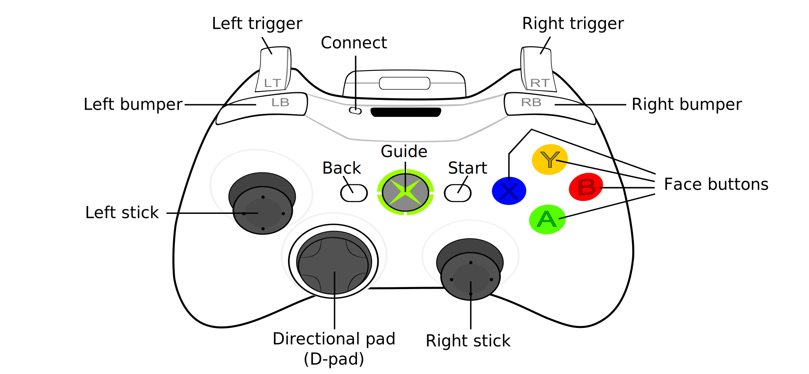

# 2026 Artemis

Our code for our 2026 robot, Artemis! Built for the Rebuilt FRC challenge.

## Controls

This robot drives field-centric.

Controller 1 (Driver Controller, Port 0):
- Left Joystick: Strafe
- Right Joystick: Turn
- Left Trigger: Prepare Shooter. Drivetrain rotates to align with hub and flywheel gets to speed.
- Right Trigger: Shoot. Indexer & Shooter Passthrough turn on. To properly shoot, both left trigger and right trigger must be pressed.
- a: Turn on brake
- b: Point swerve modules in the direction of left joystick
- Left Bumper: Reset field centric headings
- Haptic Feedback for Controller 1:
    - Left Rumble: Drivebase is aligned
    - Right Rumble: Shooter flywheel is up to speed

Controller 2 (Operator Controller, Port 1):
- a: Put intake in down position
- y: Put intake in fully up position
- b: Put intake in partially up position. During shooting, it is recommended to move the intake between fully down and partially up to move balls to the indexer.
- Right Trigger: Toggle intake
- Left Bumper: Reset 0 position for shooter hood PID
- Right Bumper: Reset 0 position for intake PID
- Left Trigger: Turn on manual mode. Release to turn off manual mode.
- Left joystick Y axis: When manual mode turned on, adjust shooter hood position.
- Right joystick Y axis: When manual mode turned on, adjust intake position.
